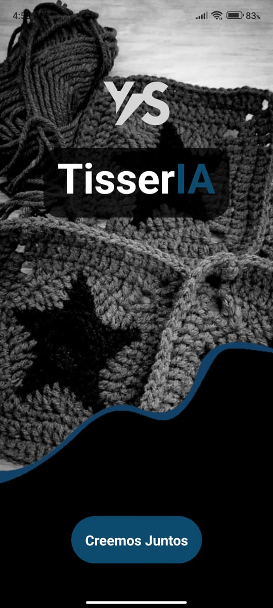

# Proyecto Final – TisserIA

## Integrantes:

- Pablo Balseca
- Yessenia Echeverria
- Stalin Sandoval
- Leonel Tualombo

## Descripción del Proyecto

Nuestro proyecto es la materialización de un aplicativo móvil diseñado con React Native. En este innovador desarrollo, abrazamos una estructura cromática cuidadosamente seleccionada, donde la armonía visual se entrelaza con la funcionalidad. No nos detenemos ahí; hemos definido dos temas distintivos: uno enaltecedor y luminoso, y otro intrigante y sombrío.

Este aplicativo móvil se comunica de manera eficaz con un robusto backend construido en Express. Nuestra backend no solo gestiona el crud de usuarios, sino que también administra el flujo de imágenes con destreza y precisión. Hemos implementado un servicio especializado de procesamiento de imágenes, donde desplegamos modelos de vanguardia como ViT y BLIP. Además, nuestra integración con OpenAI Vision añade una capa de inteligencia y sofisticación a nuestro sistema, elevando así la experiencia del usuario a nuevas alturas.

Nos enorgullece presentar un ecosistema digital que no solo responde a las necesidades actuales, sino que también anticipa y abraza el futuro con entusiasmo y determinación.

## Composición del proyecto

### Back-End

[user-service](./Back-End/user-service) - Desarrollado bajo Express (JavaScript), se encarga de gestionar el CRUD de los usuarios, la autenticación y el manejo de las imágenes.

[filter-service](./Back-End/filter-service) - Desarrollado bajo FastAPI (Python), se encarga de procesar las imágenes mandadas desde el Front-End, filtrándolas, y en caso de ser compatibles con el modelo, procesarlas para predecir el patrón a seguir.

### Fron-End

[mobile-app](./Front-End/mobile-app) - Desarrollado bajo React Native (TypeScript), encargado de construir la interfaz de usuario manejando eficientemente el estado, aplicando componentes reutilizables incluyendo una navegación intuitiva

### IA

[Notebooks](./Notebooks) - Cuadernos donde se realizo la limpieza y preparacion de los datos para el entrenamiento de Vit y BLIP.

[Datasets](./datasets.json) - Datasets utilizados para el entrenamiento de los modelos cargados en Google Drive.

### Documentación

[Metodología CRISP DM](./Metodologia CRISP-DM.pdf) - CRISP-DM significa "Cross-Industry Standard Process for Data Mining" (Proceso Estándar para la Minería de Datos en Industrias Cruzadas). Es una metodología estándar utilizada en el campo de la minería de datos y el análisis predictivo para guiar los proyectos desde la comprensión del negocio hasta la implementación de soluciones basadas en datos.

[Figma](https://www.figma.com/proto/bOMQNpejiUNXV5z84tFxQy/TisserIA?type=design&node-id=84-729&t=h3rRGDh6xm7Vujva-1&scaling=scale-down&page-id=0%3A1&starting-point-node-id=84%3A729&show-proto-sidebar=1&mode=design) - Mockup del aplicativo

